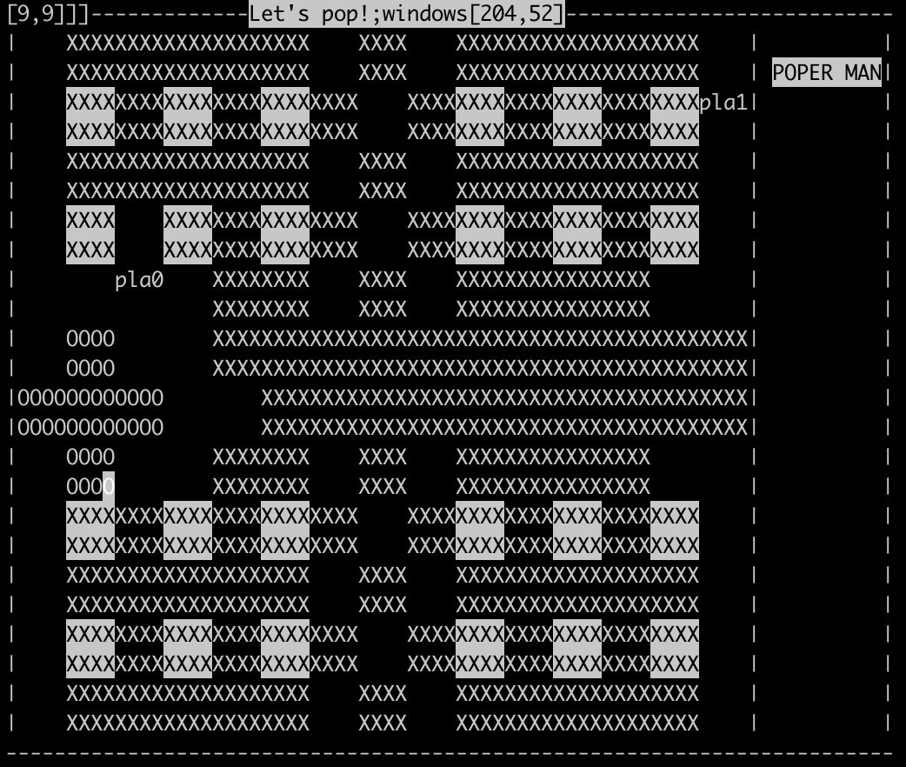

# bombman

This is a Linux game which based on <curses.h>, <socket.h> and <pthread.h>. 

## Prepare

A(n) Linux/Unix is all you need.

### Server

1. Modify the <port>.

2. Compile the server use:

```
gcc socketserver.c -o server.out
```

### Client

1. Modify the <server_name>, <port>.

*If you don't know your server name, run server.out will print it.

2. Compile the client use:

```bash
gcc pop.c -o client.out -lpthread -lcurses
```

## Play

1. Run ./server.out
2. Run ./client.out for Player1
3. Run ./client.out on the other  terminal for Player2



## Man

↑: Move up

↓: Move down

←: Move left

→: Move right

Space: Put bomb

**Goal: Blow up other player!**

